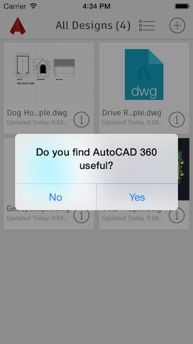
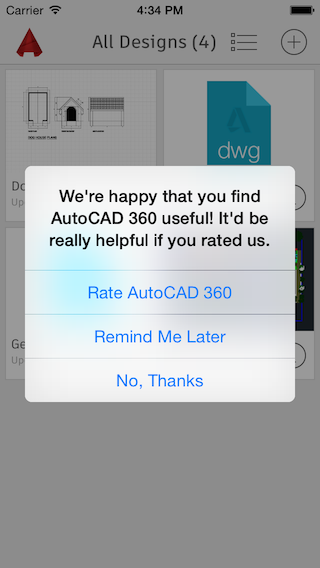
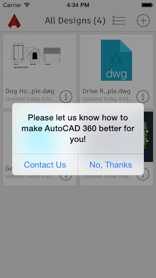

# ADAppRater
ADAppRater is a component intended to help you promote your apps in the App Store by targeting satisfied users and asking them to rate your app.

By pinpointing users who regularly engage with and think highly of your app, this approach is one of the best ways to earn positive app reviews. Following a simple installation process, you can see drastic improvements in your store rating in a matter of weeks.

* [Overview](https://git.autodesk.com/AutoCAD360/ADAppRater-iOS#overview)
  * [Support](https://git.autodesk.com/AutoCAD360/ADAppRater-iOS#support)
  * [Rater flow](https://git.autodesk.com/AutoCAD360/ADAppRater-iOS#rating-flow)
* [Features](https://git.autodesk.com/AutoCAD360/ADAppRater-iOS#features)
* [Installation](https://git.autodesk.com/AutoCAD360/ADAppRater-iOS#installation)
* [Configuration](https://git.autodesk.com/AutoCAD360/ADAppRater-iOS#configuration)
 * [Advanced Configuration](https://git.autodesk.com/AutoCAD360/ADAppRater-iOS#advanced-configuration)
* [How To Use](https://git.autodesk.com/AutoCAD360/ADAppRater-iOS#how-to-use)
* [Text Customization](https://git.autodesk.com/AutoCAD360/ADAppRater-iOS#text-customization)
 * [Email Recipient for Feedback Form](https://git.autodesk.com/AutoCAD360/ADAppRater-iOS#email-recipient-for-feedback-form)
 * [Text & Localization](https://git.autodesk.com/AutoCAD360/ADAppRater-iOS#text--localization)
* [Delegate Methods](https://git.autodesk.com/AutoCAD360/ADAppRater-iOS#delegate-methods)
 * [ADARDelegate Protocol](https://git.autodesk.com/AutoCAD360/ADAppRater-iOS#adardelegate-protocol)
 * [ADARCustomViewsDelegate Protocol](https://git.autodesk.com/AutoCAD360/ADAppRater-iOS#adarcustomviewsdelegate-protocol)
* [Developer Tools Configuration](https://git.autodesk.com/AutoCAD360/ADAppRater-iOS#developer-tools-configuration)
* [Example Project](https://git.autodesk.com/AutoCAD360/ADAppRater-iOS#example-project)
* [Contributing](https://git.autodesk.com/AutoCAD360/ADAppRater-iOS#contributing)
* [Special Thanks](https://git.autodesk.com/AutoCAD360/ADAppRater-iOS#special-thanks)
* [Contact](https://git.autodesk.com/AutoCAD360/ADAppRater-iOS#contact)

####Support
* Built for iOS 8
* Tested on iOS 7 (will most likely work on earlier versions as well)
* ADAppRater uses ARC

####Rater flow:

  

* First check user satisfaction
* Navigate satisfied users to feedback publicly in the app store
* Navigate dissatisfied users to privately send direct feedback to you 

##Features
* Target only satisfied users to achieve a higher App Store rating 
* Collect valuable feedback and complaints from dissatisfied users
* Easy to define usage parameters to target only experienced users
* Supports multiple scenarios of significant events to target users who have completed a flow
* Based on UIAlertController class (iOS 8 and later)
* Supports fallback to UIAlertView (iOS 7 and earlier)
* Custom View Delegate to create your own custom UI

##Installation
####Cocoa pod
`pod 'ADAppRater', :git => 'git@git.autodesk.com:AutoCAD360/ADAppRater-iOS.git', :branch => 'master' ` 

####Standard installation
1. Download project to desktop
2. Drag and drop the ‘ADAppRater’ folder to your project
3. When prompted - mark ‘Copy items if needed’

Do not forget to add `#import "ADAppRater.h"` where needed

##Configuration
ADAppRater requires no configuration and can perform as is, simply using default configuration and the application's current plist details.

If you do wish to configure ADAppRater, I suggest doing so *before* the app has finished launching, i.e. in the AppDelegate's `application: didFinishLaunchingWithOptions:` method, like this:

    #import "ADAppRater.h"

	- (BOOL)application:(UIApplication *)application didFinishLaunchingWithOptions:(NSDictionary *)launchOptions 
    {
      // Override point for customization after application launch.
      [ADAppRater sharedInstance].currentVersionDaysUntilPrompt = 1;
      [ADAppRater sharedInstance].currentVersionLaunchesUntilPrompt = 3;
      [ADAppRater sharedInstance].remindWaitPeriod = 5;
      [ADAppRater sharedInstance].promptForNewVersionIfUserRated = NO;
      
      return YES;
    }

###Advanced configuration
ADAppRater supports multiple scenarios of significant events to target users who have reached a certain goal.

The user will be prompted to rate the app if he completes any of these scenarios, along with the basic configuration as well.

    // First Scenario: At least 3 events of Type A
    ADEventCriteria* criteria1 = [[ADEventCriteria alloc] initWithEventName:@”TypeA” eventCount:3];
    ADEventScenario* scenario1 = [[ADEventScenario alloc] initWithEventCriterias:@[criteria1]];
    
    // Second Scenario: At least 5 events of Type B
    ADEventCriteria* criteria2 = [[ADEventCriteria alloc] initWithEventName:@”TypeB” eventCount:5];
    ADEventScenario* scenario2 = [[ADEventScenario alloc] initWithEventCriterias:@[criteria2]];
    
    // Third Scenario: At least 1 event of each type
    ADEventCriteria* criteria3 = [[ADEventCriteria alloc] initWithEventName:@”TypeA” eventCount:1];
    ADEventCriteria* criteria4 = [[ADEventCriteria alloc] initWithEventName:@”TypeB” eventCount:1];
    ADEventScenario* scenario3 = [[ADEventScenario alloc] initWithEventCriterias:@[criteria3, criteria4]];
    
    [ADAppRater sharedInstance].eventScenariosUntilPrompt = @[scenario1, scenario2, scenario3];

##How To Use

    - (void)startRaterFlowFromViewController:(__weak UIViewController*)viewController;
Immediately invoke the Rater flow, starting with checking user satisfaction.
The only condition checked is confirming that the device is online

    - (void)startRaterFlowIfCriteriaMetFromViewController:(__weak UIViewController*)viewController;
Invoke the Rater flow only if all configurable criterias have been met, at least one event scenario is completed (if defined any), and app store connection is available.

    - (BOOL)shouldPromptForRating;
Returns `YES` if the all configurable criterias have been met and at least one event scenario is completed (if defined any).
Returns `NO` otherwise.

    - (void)registerEvent:(NSString*)eventName withViewController:(__weak UIViewController*)viewController;
Call this method to notify ADAppRater that a significant event has occurred. This method can be called from anywhere in your app and increments the event count.

This method also invokes the `startRaterFlowIfCriteriaMetFromViewController:` to check if any scenario has now been completed and to present the Rater flow if so.

    - (void)promptDirectRatingFromViewController:(__weak UIViewController*)viewController;
Immediately prompt user to rate the app, skipping the flow of first checking user satisfaction.
The only condition checked is that the device is online.

##Text Customization
ADAppRater is not localized and has only default English strings.
All strings used for the default UI flow are bundled in an `ADAppRaterTexts` class. You can either access the default instance or create a new instance and override the new one:
`[ADAppRater sharedInstance].localStrings`
Or

	ADAppRaterTexts* newStrings = [[ADAppRaterTexts alloc] initWithApplicationName:@"App Name" feedbackRecipientEmail:@"support@your.mail"];
	[ADAppRater sharedInstance].localStrings = newStrings;

###Email Recipient for Feedback Form
To set an email address to be used as a recipient in the default feedback form, insert the mail address to `ADAppRaterTexts` property:

	@property (nonatomic, strong) NSString* feedbackFormRecipient;

###Text & Localization
To customize the texts ADAppRater will display, insert your customized strings to the appropriate `ADAppRaterTexts` property:

	@property (nonatomic, strong) NSString* userSatisfactionAlertTitle;
	@property (nonatomic, strong) NSString* userSatisfactionAlertMessage;
	@property (nonatomic, strong) NSString* userSatisfactionAlertAnswerYes;
	@property (nonatomic, strong) NSString* userSatisfactionAlertAnswerNo;
	
	@property (nonatomic, strong) NSString* appRatingAlertTitle;
	@property (nonatomic, strong) NSString* appRatingAlertMessage;
	@property (nonatomic, strong) NSString* appRatingAlertAnswerRate;
	@property (nonatomic, strong) NSString* appRatingAlertAnswerRemindMe;
	@property (nonatomic, strong) NSString* appRatingAlertAnswerDontRate;

	@property (nonatomic, strong) NSString* userFeedbackAlertTitle;
	@property (nonatomic, strong) NSString* userFeedbackAlertMessage;
	@property (nonatomic, strong) NSString* userFeedbackAlertAnswerYes;
	@property (nonatomic, strong) NSString* userFeedbackAlertAnswerNo;
	
	@property (nonatomic, strong) NSString* thankUserAlertTitle;
	@property (nonatomic, strong) NSString* thankUserAlertMessage;
	@property (nonatomic, strong) NSString* thankUserAlertDismiss;
	
	@property (nonatomic, strong) NSString* feedbackFormRecipient;
	@property (nonatomic, strong) NSString* feedbackFormSubject;
	@property (nonatomic, strong) NSString* feedbackFormBody;

##Delegate Methods
ADAppRater has two different types of protocols that can implemented.
- Implement `ADARDelegate` to be notified on every step of the Rater flow.
- Implement `ADARCustomViewsDelegate` to use your own custom views for each step of the Rater flow.

###ADARDelegate Protocol
All delegate methods are __optional__:

    - (void)appRaterWillPromptUserSatisfaction;
    - (void)appRaterWillPromptUserRating;
    - (void)appRaterWillPromptFeedbackRequest;
    - (void)appRaterWillDisplayThankYouAlert;
    
    - (void)appRaterUserDidAgreeToRateApp;
    - (void)appRaterUserDidDeclineToRateApp;
    - (void)appRaterUserDidRequestReminderToRateApp;
    
    - (void)appRaterUserDidAgreeToSendFeedback;
    - (void)appRaterUserDidDeclineToSendFeedback;
    
    - (void)appRaterAppStoreDidOpen;
    - (void)appRaterAppStoreCouldNotConnect:(NSError *)error;

###ADARCustomViewsDelegate Protocol
All delegate methods are __optional__:

    - (void)promptUserSatisfationAlertFromViewController:(UIViewController*)viewController
                                      userSatisfiedBlock:(ADAppRaterCustomViewBlock)userSatisfiedBlock 
                                   userNotSatisfiedBlock:(ADAppRaterCustomViewBlock)userNotSatisfiedBlock;
Implement this method to provide a custom view or custom texts to check user satisfaction within the app.
This is the first step of the Rater flow. This method is called to first check if the user likes the app.
If you do not implement this method, the default UI and text will be used.

    - (void)promptAppRatingAlertFromViewController:(UIViewController *)viewController 
                              userWillRateAppBlock:(ADAppRaterCustomViewBlock)userWillRateAppBlock 
                              remindUserLaterBlock:(ADAppRaterCustomViewBlock)remindUserLaterBlock 
                                  userRefusedBlock:(ADAppRaterCustomViewBlock)userRefusedBlock;
Implement this method to provide a custom view or custom texts to ask user to rate the app. 
This method is called if a user answered he is satisfied with app.
If you do not implement this method, the default UI and text will be used.

    - (void)promptFeedbackRequestAlertFromViewController:(UIViewController*)viewController
                               userWillSendFeedbackBlock:(ADAppRaterCustomViewBlock)userWillSendFeedbackBlock
                            userWillNotSendFeedbackBlock:(ADAppRaterCustomViewBlock)userWillNotSendFeedbackBlock;
Implement this method to provide a custom view or custom texts to request the user to send feedback.
This method is called if a user answered he is not satisfied with app.
If you do not implement this method, the default UI and text will be used.

    - (void)displayThankYouAlertFromViewController:(UIViewController*)viewController 
                                   completionBlock:(ADAppRaterCustomViewBlock)completion;
Implement this method to provide a custom view or custom texts to thank the user for his feedback. 
This method is called if a user has successfully sent his feedback.
If you do not implement this method, the default UI and text will be used.

    - (void)presentFeedbackFormFromViewController:(UIViewController*)viewController
                            userSentFeedbackBlock:(ADAppRaterCustomViewBlock)userSentFeedbackBlock 
                      userDidNotSendFeedbackBlock:(ADAppRaterCustomViewBlock)userDidNotSendFeedbackBlock;
Implement this method to provide a custom form or custom texts for the feedback email/form. 
This method is called if a user has agreed to send feedback after answering he is not satisfied with the app.
If you do not implement this method, the default email app will be used.

## Developer Tools Configuration
ADAppRater supports several properties to help developers debug:

    @property (nonatomic) BOOL enableLog;
ADAppRater has many log messages to track the flow and state. Disabling logging message stops the printout of these logs to the console.
Default is `NO` (for production environments). Set to `YES` to start printing log messages.

    @property (nonatomic) BOOL previewMode;
If set to `YES`, ADAppRater will always start the prompt flow for any interaction, regardless of how it is configured or significant events logged. Use this to proofread your texts during testing.
This property is wrapped with *__`DEBUG`__* compilation flags so it won’t appear in Release compilation.
__Make sure__ any call your app makes to the property is also wrapped with compilation flags or deleted before submission.

    - (void)resetUsageHistory;
A developer method to reset saved usage of significant events to start over.

This method is wrapped with *__`DEBUG`__* compilation flags so it won’t appear in Release compilation.
__Make sure__ any call your app makes to this method is also wrapped with compilation flags or deleted before submission.

    - (void)appRaterLogToConsole:(NSString*)message;
Part of the `ADARDelegate` protocol. Implement this method to provide a custom logging component (instead of `NSLog`). __Optional__

##Example Project
1. Download project to desktop
2. Open the ‘ADAppRater Demo’ App
3. The demo app demonstrates 3 ways to use the component:
  1. Default UI flow without scenarios
  2. Custom View Delegate implementation, without scenarios
  3. Default UI flow with several scenarios of significant events

__Pay attention to the log console to follow the flow__

## Contributing
See [Contributing](./Contributing.md) page.

##Special Thanks
- I'd appreciate a github star if you find this useful.
- A special thanks to Nick Lockwood and [iRate](https://github.com/nicklockwood/iRate) which was a great inspiration and example for this project.

##Contact
[Amir Shavit](https://github.com/ashavit)

[Twitter](https://twitter.com/ashavit3)

[LinkedIn](https://il.linkedin.com/pub/amir-shavit/1/b9/42a)

